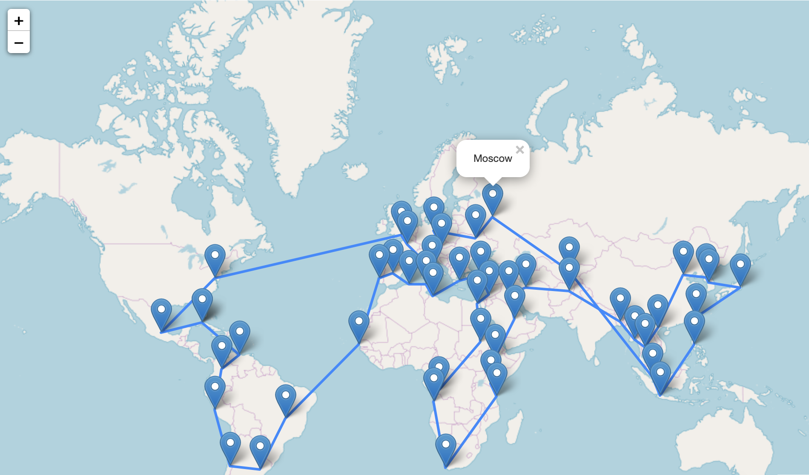

# Simulation and Monte Carlo Project - Ensae Paris - 2nd year

Dans ce projet, on utilise deux approches pour approximer la solution optimale d'un probleme TSP (Traveling Salesman Problem)

Les deux approches sont fondées sur la Cross Entropy Method de Reuven Rubinstein. 
La deuxieme approche ajoute une touche bayésienne.

In this project, two approaches are used to approximate the optimal solution of a TSP (Traveling Salesman Problem).

Both approaches are based on Reuven Rubinstein's Cross Entropy Method. 
The second approach study the effect of adding a Bayesian component in the algorithm.

